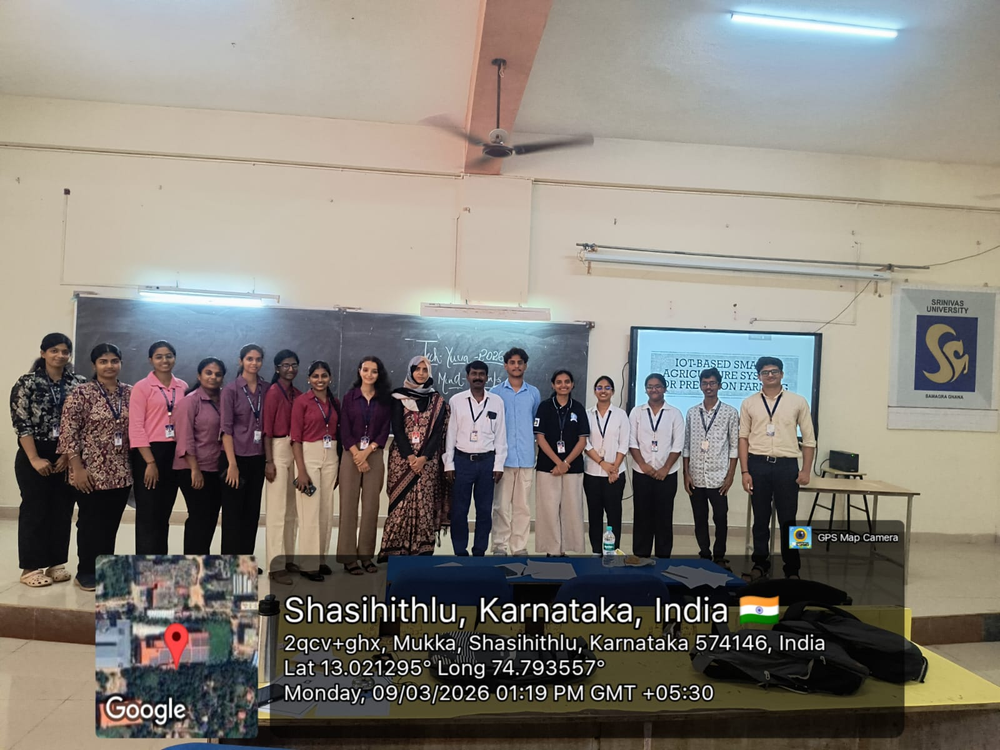
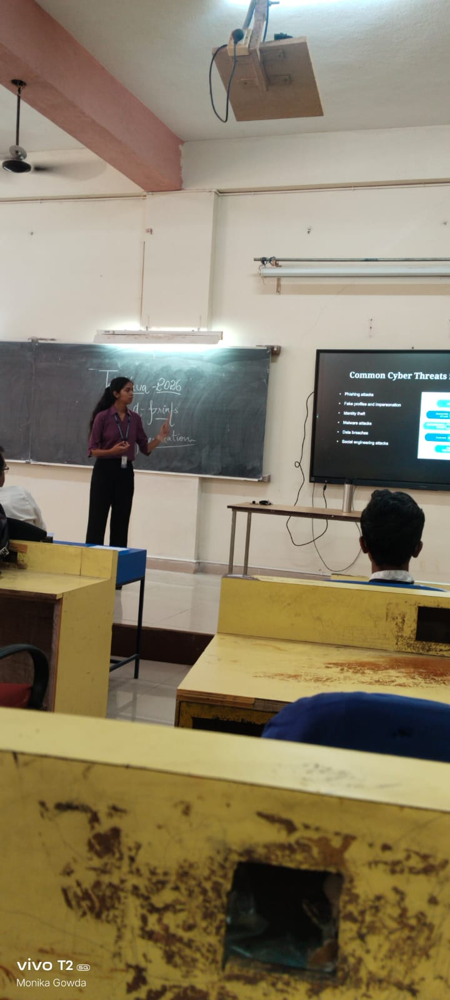
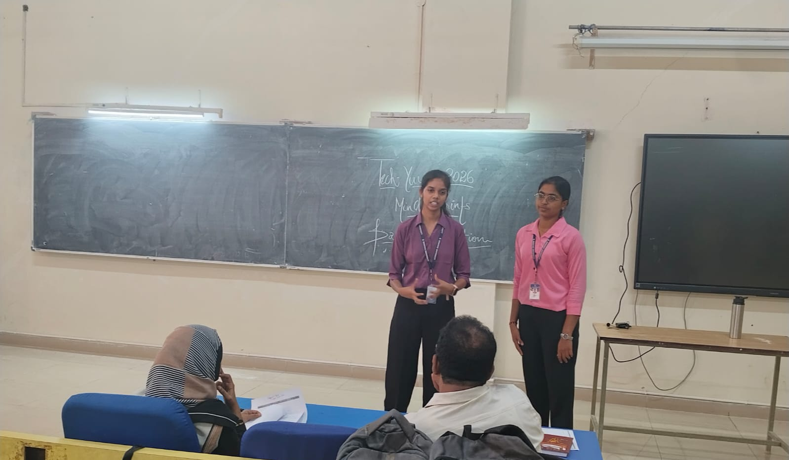
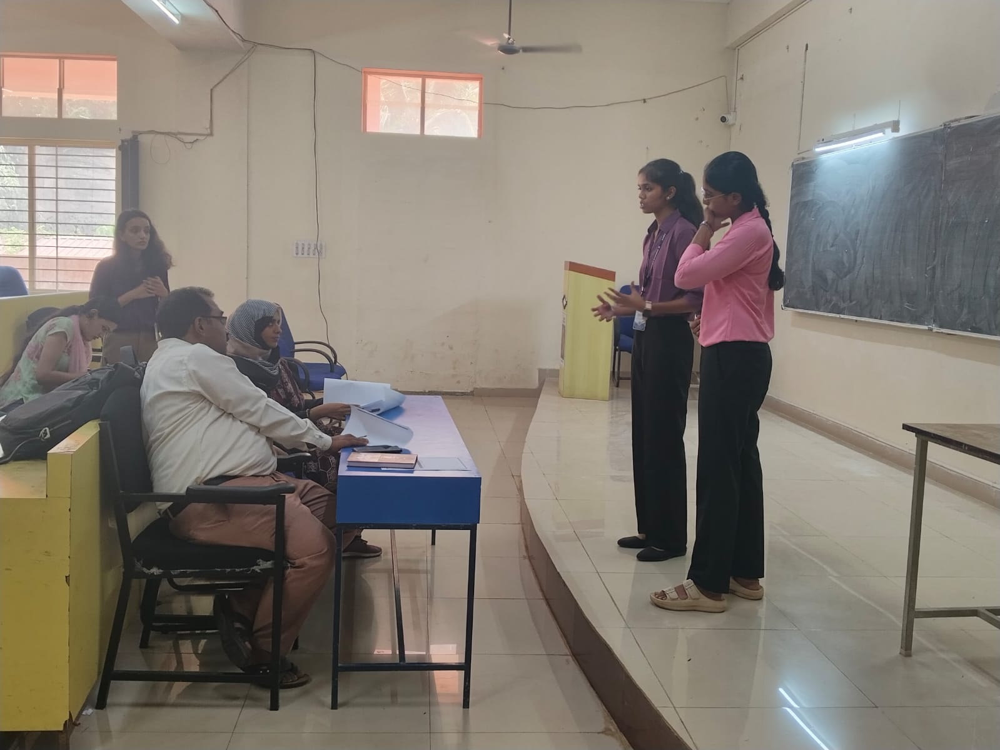

# 🔐 MindPrints – Cybersecurity in Social Media

This repository contains a **paper presentation and study on Cybersecurity in Social Media Platforms**.  
The project analyzes major cybersecurity threats that occur on social media and explains methods to protect users and their data.

---

## 📌 Project Overview

Social media platforms such as **Facebook, Instagram, Twitter, and YouTube** are widely used for communication and information sharing. However, the rapid growth of these platforms has increased cybersecurity threats such as:

- Phishing attacks  
- Identity theft  
- Malware attacks  
- Account hacking  
- Data breaches  
- Fake profiles  

This project studies these threats and discusses security solutions to protect social media users.

---

## 🎯 Objectives

- To analyze cybersecurity threats in social media platforms  
- To study the impact of cyberattacks on users  
- To identify security vulnerabilities in social media usage  
- To explore cybersecurity techniques used to protect data  
- To promote safe and responsible social media usage  

---

## ⚠️ Common Cybersecurity Threats

### 1️⃣ Phishing Attacks
Fake messages or links that trick users into revealing passwords or personal information.

### 2️⃣ Malware Attacks
Malicious software that can steal data or damage user devices.

### 3️⃣ Identity Theft
Attackers steal personal information to create fake profiles or perform fraud.

### 4️⃣ Account Hijacking
Unauthorized access to a user's social media account.

### 5️⃣ Cyberbullying
Harassment or threats using online communication platforms.

---

## 🛡️ Security Solutions

Important cybersecurity practices include:

- Using strong passwords  
- Enabling **Two-Factor Authentication (2FA)**  
- Adjusting privacy settings  
- Avoiding suspicious links  
- Increasing cybersecurity awareness  
- Using AI-based security monitoring systems  

---

## 📢 Event

**National Level Technical Event – Tech Yuva 2026**  
Organized by **Srinivas University Institute of Engineering and Technology, Mangalore**

---

## 📸 Event Poster

  

---

## 📸 Paper Presentation Photos

  
  

  
  

---

## 📂 Project Files

- 📄 **PaperPresentation.pdf** – Research paper on Cybersecurity in Social Media  
- 📊 **Paper Presentation.pptx** – Presentation slides used for the seminar  

---

## 📚 References

- IEEE Computer Society – Cybersecurity and Privacy Research  
- NIST Cybersecurity Framework  
- Statista Cybersecurity Reports  
- Journal of Big Data Research Papers  

---

## 👩‍💻 Authors

**Tejashwini Havanur** 
**Suhani**

Department of Computer Science and Engineering  
Srinivas University Institute of Engineering and Technology  
Mangalore, India  

---

⭐ If you found this project useful, feel free to **star the repository**.
